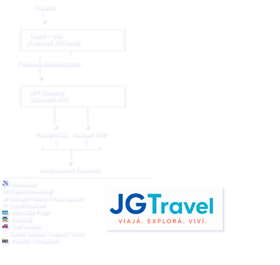

## Tecnologías principales

## Dominios del negocio

Usuarios

Autenticación

Perfil del Viajero

Destinos

Experiencias

Paquetes Turísticos

Vuelos

Hoteles

Rent a Car

Bus Trips

Restaurantes

Seguros de Viaje

Reservas

Pagos

Favoritos

Notificaciones

Administración

Backoffice

Integraciones


## PROVEEDORES 

|  Dominio    | Proveedor inicial | Reemplazable
| Vuelos      | Amadeus           | ✅          
| Hoteles     | Amadeus           | ✅            |
| Mapas       | OpenStreetMap     | ✅            |
| Clima       | OpenWeather       | ✅            |
| Gastronomía | Google Places /   |
|             |      Foursquare   | ✅            |
| Rent a Car  | CarTrawler        | ✅            |
| Bus         | Busbud            | ✅            |
| Seguros     | Cover Genius /    |
|             |  Allianz / AXA    | ✅            |
| Pagos       | Mercado Pago      | ✅            |
| Imágenes    | Pexels / Unsplash | ✅            |


## ****El Mercado Tecnológico Actual en el Sector Turismo****

-   ****Velocidad de carga es conversión:**** Un retraso de un segundo en la carga web puede reducir las conversiones hoteleras y de reservas hasta en un 20%. Las páginas pesadas ya no son una opción.
-   ****Mobile-First y Reactividad:**** Los viajeros reservan cada vez más desde dispositivos móviles mientras están en viaje, exigiendo interfaces fluidas que se sientan como una app nativa.
-   ****Centralización de Datos (APIs):**** Las plataformas modernas ya no guardan toda la información en servidores propios; actúan como "agregadores inteligentes" que consumen datos en tiempo real (vuelos, clima, mapas) y los muestran de forma unificada.

### ****Justificación Técnica de las Elecciones del Roadmap****

-   ****⚛️ Frontend**** ****React + Vite + TypeScript (Sprint 1)****

****Vite:**** Reemplazó por completo a los viejos entornos como Create React App. Su servidor de desarrollo basado en módulos ESM nativos ofrece una velocidad de compilación casi instantánea. Para JGTravel, esto se traduce en tiempos de despliegue mínimos en producción y un rendimiento óptimo de cara al usuario.

****TypeScript:**** En una plataforma que manejará pasarelas de pago (Mercado Pago), reservas de vuelos (Amadeus) y estructuras de datos complejas de hoteles, el tipado estático de TypeScript evita errores en producción. Garantiza que un dato de tipo Precio o ID\_Reserva nunca se rompa ni se confunda en el código.

****React + React Router:**** Sigue siendo el estándar de la industria para crear Single Page Applications (SPA). Permite que el usuario navegue entre la búsqueda de hoteles, el clima y los mapas sin que la página tenga que recargarse por completo, emulando una experiencia inmersiva.

-   ****🌐 Internacionalización: i18next (Sprint 1)****

****i18next:**** Es la librería líder del mercado para React. Se eligió porque maneja la carga perezosa (lazy loading) de las traducciones. Esto significa que si un usuario entra en Español (ES), el navegador no gastará datos en cargar los archivos de Inglés (EN) o Portugués (PT) hasta que sea necesario, manteniendo la aplicación ligera.

🛠️ Estrategia de Implementación Técnica (i18next)

bPara garantizar un rendimiento óptimo y no penalizar la velocidad de carga de la web en dispositivos móviles (clave para el viajero en ruta) \[Roadmap\], el soporte de estos idiomas se implementa bajo las siguientes reglas técnicas en el ****Sprint 1****:

1.  ****Lazy Loading (Carga Perezosa):**** Los archivos de traducción (`JSON`) se dividen por namespaces (ej. `common.json`, `auth.json`, `booking.json`). Solo se descarga en el navegador el idioma seleccionado por el usuario.
2.  ****Detección Automática de Idioma:**** La plataforma utiliza plugins de i18next para detectar el idioma del navegador del usuario o las cookies de su última sesión, adaptando la experiencia al instante.
3.  ****Soporte de Monedas Localizadas:**** La internacionalización trabaja en conjunto con la simulación de negocio para mostrar formatos numéricos, de fecha y símbolos de moneda adecuados a cada región.


-   ****🔥 Backend y Gestión: Firebase (Sprint 3)****

****Firebase Authentication:**** Desarrollar un sistema de usuarios seguro desde cero requiere meses de trabajo y auditorías. Se eligió Firebase porque resuelve el Login con Google y la gestión de sesiones en cuestión de horas con estándares bancarios de seguridad, permitiendo al equipo concentrarse en la lógica del negocio turístico.

-   ****🗺️ Mapas y Entorno: OpenStreetMap + Leaflet (Sprint 4)****

****Leaflet:**** A diferencia de la API de Google Maps tradicional, que puede volverse extremadamente costosa al escalar en volumen de usuarios, la combinación de OpenStreetMap y Leaflet es de código abierto, altamente personalizable y gratuita. Esto permite renderizar mapas de Salta y Latinoamérica de forma interactiva y fluida sin comprometer el presupuesto del proyecto.

-   ****💳 Simulación e Integración:  (Sprint 5)Backoffice + Pagos

Proveedor inicial

Dolibarr

Mercado Pago

Reemplazable

## 5\. ARQUITECTURA DE LA PLATAFORMA

Para soportar la escala del Roadmap de ****JGTravel**** (multilenguaje, múltiples APIs y simulación de negocio), se implementará una arquitectura basada en el patrón ****Feature-Driven Development (FDD) / Feature-Sliced Design**** \[Roadmap\]. Este enfoque permite desacoplar los módulos del negocio (como vuelos, enoturismo o pasarela de pagos) para que el proyecto sea mantenible en el tiempo \[Roadmap\].

🗺️ 5.1 Patrón de Diseño Frontend: Feature-Driven

En lugar de agrupar todo por tipos de archivos técnicos (todos los componentes juntos, todos los hooks juntos), el código se organiza por ****módulos de negocio (Features)****. Cada funcionalidad compleja es autosuficiente.

-   ****Ventaja:**** Si necesitamos modificar o auditar la integración de __Mercado Pago__ o el mapa de __Leaflet__, todo su código relacionado (componentes visuales, lógica, tipos e interfaces) se encuentra concentrado en una sola carpeta \[Roadmap\].

📂 5.2 Estructura de Carpetas Propuesta (Sprint 2)

A continuación, se detalla el árbol de directorios que configuraremos en la raíz del proyecto (`/src`) durante el refactor de la estructura \[Roadmap\]:

src/

├── assets/ # Recursos estáticos globales (imágenes, logos de JGTravel)

├── components/ # Componentes UI globales y atómicos (Botones, Inputs del Design System)

├── config/ # Configuraciones globales (firebase.ts, i18n.ts, apiClients.ts)

├── context/ # Contextos globales de React (AuthContext, ThemeContext)

├── features/ # MÓDULOS DE NEGOCIO (Núcleo de la arquitectura)

│ ├── auth/ # Login, Registro, Firebase Auth Hooks \[Sprint 3\]

│ ├── flights-hotels/ # Integración con Amadeus API \[Sprint 4\]

│ ├── maps/ # Mapas interactivos, Leaflet, capas de Salta \[Sprint 4\]

│ ├── experiences/ # Enoturismo, Educativo, Empresarial, API Pexels/Places \[Sprint 4\]

│ └── checkout/ # Reservas, Carrito, Integración Mercado Pago Sandbox \[Sprint 5\]

├── hooks/ # Custom Hooks reutilizables a nivel global (useFetch, useWindowSize)

├── routes/ # Configuración y definición de rutas con React Router

├── types/ # Interfaces y Tipos de TypeScript globales e inmutables

├── utils/ # Funciones utilitarias (formateadores de fechas, monedas, validadores)

├── App.tsx # Componente raíz de la aplicación

└── main.tsx # Punto de entrada de Vite para el renderizado en el DOM

⚙️ 5.3 Pilares Técnicos de la Arquitectura

1.  ****Desacoplamiento de APIs (Capas de Servicio):**** Las llamadas a las APIs externas (Amadeus, OpenWeather, etc.) no se harán directamente dentro de los componentes visuales \[Roadmap\]. Se crearán __servicios__ aislados dentro de cada `feature` para mapear y limpiar las respuestas antes de que lleguen a la interfaz.
2.  ****Estado Predictivo y Contextual:**** El estado de la autenticación de usuarios (Firebase) se manejará mediante un `Context` global de React, asegurando que cualquier pantalla sepa si el usuario es un cliente corporativo, educativo o turista local \[Roadmap\].
3.  ****Tipado Estricto de Datos:**** Cada entidad del negocio (ej: `Vuelo`, `Reserva`, `Bodega`, `Usuario`) tendrá un tipo de TypeScript inmutable definido. Esto garantiza que las simulaciones con el ERP Dolibarr y los esquemas de Mercado Pago no rompan el flujo de datos \[Roadmap\].
4.  ****Enrutamiento Dinámico:**** Controlado por __React Router__, implementando la división de código (__Code Splitting__) a través de `React.lazy`. Las vistas pesadas (como la pantalla de mapas interactivos del Sprint 4) solo se cargarán cuando el usuario navegue hacia ellas \[Roadmap\], optimizando el rendimiento de carga inicial.
-----------------------------------------------
# 02 - Software Architecture

## ¿Cómo está construida la plataforma?

JGTravel está diseñada bajo un enfoque **Mobile-First** y funciona como un **agregador inteligente de datos**. En lugar de almacenar toda la información en servidores propios, consume e integra múltiples APIs externas en tiempo real para optimizar la velocidad de carga y la conversión.

### 1. Tecnologías Principales y Justificación

*   **Frontend (React + Vite + TypeScript):** SPA reactiva con compilación instantánea y tipado estático para mitigar errores en la integración de pasarelas de pago y datos complejos de reservas.
*   **Internacionalización (i18next):** Soporte multiidioma implementado con *Lazy Loading* (carga perezosa de JSONs por namespaces) para no penalizar el rendimiento móvil.
*   **Autenticación y Gestión (Firebase Auth):** Delegación de la seguridad de sesiones y login social (Google) bajo estándares bancarios.
*   **Mapas y Entorno (OpenStreetMap + Leaflet):** Renderizado de mapas interactivos de código abierto, evitando los costos elevados de licencias comerciales.
*   **Simulación de Negocio (Dolibarr ERP + Mercado Pago Sandbox):** Conexión directa con la facturación y flujos reales del negocio familiar, validando cobros en entornos de prueba seguros.

### 2. Patrón de Diseño: Feature-Sliced Design (FDD)

Para garantizar la mantenibilidad y el desacoplamiento de las APIs, el código se organiza por **módulos de negocio independientes (Features)** en lugar de tipos de archivos técnicos. 

#### Pilares de la Arquitectura:
*   **Desacoplamiento:** Las llamadas a las APIs externas no se mezclan con los componentes visuales; se aíslan en capas de servicio internas para limpiar los datos.
*   **Autosuficiencia:** Cada funcionalidad compleja concentra sus propios componentes, lógica, tipos e interfaces en una sola carpeta.

### 3. Estructura del Proyecto (`/src`)

```text
src/
├── assets/         # Recursos estáticos globales (logos, imágenes)
├── components/     # UI Atómica del Design System (Botones, Inputs)
├── config/         # Ajustes globales (firebase.ts, i18n.ts, apiClients.ts)
├── context/        # Estados globales compartidos (AuthContext, ThemeContext)
├── features/       # MÓDULOS DE NEGOCIO AUTOSUFICIENTES
│   ├── auth/           # Login, Registro y Firebase Hooks [Sprint 3]
│   ├── flights-hotels/ # Integración con API de Amadeus [Sprint 4]
│   ├── maps/           # Capas de mapas y Leaflet [Sprint 4]
│   ├── experiences/    # Enoturismo y APIs de imágenes/lugares [Sprint 4]
│   └── checkout/       # Carrito y Sandbox de Mercado Pago [Sprint 5]
├── hooks/          # Custom Hooks globales reutilizables (useFetch)
├── routes/         # Enrutamiento de la SPA con React Router
├── types/          # Tipados e interfaces globales inmutables
├── utils/          # Formateadores utilitarios (monedas, fechas)
├── App.tsx         # Componente raíz
└── main.tsx        # Punto de entrada de Vite al DOM
```

### 4. Dominios del Negocio e Integraciones

La plataforma centraliza e intercambia los siguientes dominios modulares con proveedores externos 100% reemplazables:

| Dominio | Proveedor Inicial |
| :--- | :--- |
| **Vuelos y Hoteles** | Amadeus |
| **Mapas** | OpenStreetMap / Leaflet |
| **Clima** | OpenWeather |
| **Gastronomía** | Google Places / Foursquare |
| **Rent a Car** | CarTrawler |
| **Bus** | Busbud |
| **Seguros** | Cover Genius / Allianz / AXA |
| **Pagos** | Mercado Pago |
| **Imágenes** | Pexels / Unsplash |
| **Módulos de Core** | Usuarios, Perfil, Destinos, Experiencias, Paquetes, Reservas, Favoritos, Notificaciones, Backoffice y Administración. |


# Arquitectura General



Descripción... ¿Por qué este diagrama es tan importante?

Porque define una regla que vamos a respetar durante todo el proyecto:

React nunca hablará directamente con un proveedor externo.

Siempre existirá una capa intermedia.

Eso nos da:

seguridad,
independencia,
posibilidad de cambiar proveedores,
pruebas más simples,
mantenimiento más sencillo.