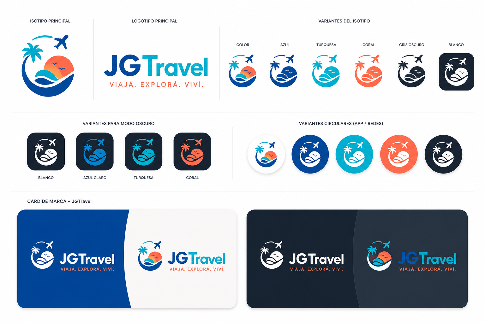

# 03-DesignSystem.md
# JGTravel Design System

## Objetivo

Definir la identidad visual, los principios de diseño y los componentes reutilizables de la plataforma JGTravel, garantizando una experiencia consistente, accesible y escalable en todos los dispositivos.

## 1. Principios de Diseño

Toda la interfaz de JGTravel debe transmitir:

* Confianza
* Tecnología
* Cercanía
* Inspiración para viajar
* Rapidez
* Claridad
* Profesionalismo

La interfaz prioriza la simplicidad, evitando elementos innecesarios y reduciendo la carga cognitiva del usuario durante el proceso de búsqueda y reserva.

## Identidad Visual

### Isotipo

El isotipo representa la esencia de la marca mediante cuatro elementos principales:

- 🌴 Palmera
- 🌊 Mar
- ☀️ Sol
- ✈️ Avión

La composición comunica turismo, libertad, naturaleza y movimiento.

Representa el viaje como experiencia.

### Logotipo

El logotipo combina una tipografía moderna con el isotipo para representar una marca tecnológica orientada al turismo.

**Nombre comercial**

JGTravel

**Slogan**

Viajá. Explorá. Viví.

**Variantes**

| Variante | Uso |
|----------|-----|
| Principal | Web |
| Oscura | Dark Mode |
| Monocromática | Impresión |
| App | Aplicaciones móviles |
| Redes Sociales | Perfil y avatar |

## 4. Paleta de colores

| Color          | Hex     | Uso        |
| -------------- | ------- | ---------- | RGB
| Azul Principal | #0057B8 | Marca      |
| Turquesa       | #11C5E8 | Tecnología |
| Coral          | #FF6B57 | CTA        |
| Blanco         | #FFFFFF | Fondo      |
| Gris Oscuro    | #1E2736 | Dark Theme |
| Gris Claro     | #F4F6F8 | Background |

## Design Tokens

Los Design Tokens representan la fuente única de verdad para colores, tipografías, espaciados, radios, sombras y animaciones.

Estos valores serán implementados mediante variables CSS y reutilizados por todos los componentes de la aplicación.

--color-primary

--color-secondary

--spacing-md

--radius-lg

--shadow-md

### Significado

Azul

Confianza

Turquesa

Innovación

Coral

Experiencias

Blanco

Minimalismo

Gris

Elegancia

## 5. Tipografía

## Encabezados

Fuente principal:

- Montserrat
- Poppins

Pesos

600

700

800

## Texto

Fuente

Inter

Pesos

400

500

### Escala tipográfica

| Elemento | Tamaño |
| -------- | ------ |
| H1       | 48px   |
| H2       | 40px   |
| H3       | 32px   |
| H4       | 28px   |
| H5       | 24px   |
| Body     | 16px   |
| Small    | 14px   |

## 6. Espaciado

| Token | Valor |
| ----- | ----- |
| xs    | 4px   |
| sm    | 8px   |
| md    | 16px  |
| lg    | 24px  |
| xl    | 32px  |
| xxl   | 48px  |

Sistema de 8px.

## 7. Bordes

| Tipo   | Radio |
| ------ | ----- |
| Small  | 4px   |
| Medium | 8px   |
| Large  | 16px  |
| Extra  | 24px  |

## 8. Sombras

shadow-sm

shadow-md

shadow-lg

## 9. Iconografía

Biblioteca principal

Font Awesome

Biblioteca secundaria

SVG propios de JGTravel

✈ 🧳 🏨 🍽 🚌 🚗📍 ❤️ 🔔

## 10. Componentes
### Button

Componente principal para acciones del usuario.

Variantes

- Primary
- Secondary
- Outline
- Ghost
- Danger
- Disabled
- Loading

### Input

Text

Search

Email

Password

Date

Select

### Cards

Destino

Hotel

Paquete

Experiencia

Restaurante

### Badge

Oferta

Premium

Nuevo

Completo

### Alert

Success

Warning

Danger

Info

### Loader

Spinner

Skeleton

## 11. Responsive
| Breakpoint | Pixels |Dispositivo| 
| ---------- | ------ | --------- |
| xs         | 320    |     |
| sm         | 576    |     |
| md         | 768    |     |
| lg         | 992    |     |
| xl         | 1200   |     |
| xxl        | 1440   |     |

## 12. Accesibilidad

* Contraste WCAG AA.
* Navegación mediante teclado.
* Etiquetas ARIA.
* Estados visibles de foco(:focus-visible).
* Tamaños táctiles mínimos de 44 × 44 px.

## 13. Modo Oscuro

La plataforma implementará soporte nativo para modo claro y modo oscuro utilizando las variantes oficiales del logotipo y la paleta cromática definida por la marca.

## 14. Animaciones

Framer Motion.

Duración
150 ms
250 ms
350 ms

Curvas

ease

ease-in-out

## 15. Grid System

La plataforma utiliza un sistema basado en 12 columnas.

Container

- xs: 100%
- sm: 540px
- md: 720px
- lg: 960px
- xl: 1140px
- xxl: 1320px

Gutter

24px

## Elevaciones

Shadow 1

0 2px 8px rgba(0,0,0,.08)

Shadow 2

0 8px 20px rgba(0,0,0,.12)

Shadow 3

0 16px 32px rgba(0,0,0,.18)

## Estados

Default

Hover

Pressed

Focused

Disabled

Loading

## Design Tokens

Primary Color

--color-primary

Secondary Color

--color-secondary

Border Radius

--radius-md

Shadow

--shadow-lg

Spacing

--space-4

Typography

--font-title

## Futuras mejoras

* Tema personalizable.
* Alto contraste.
* Escalado tipográfico.
* Diseño adaptativo para tablets y kioscos turísticos.
* Internacionalización visual.
