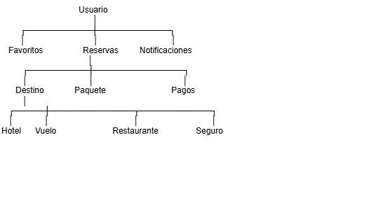

# JGTravel

# Modelo de Dominio y Diseño de Base de Datos

# Objetivo

Este documento define el modelo conceptual de datos de JGTravel. Antes de diseñar la base de datos física, se identifican las entidades del negocio, sus relaciones y responsabilidades. Este modelo servirá como base para la implementación en PostgreSQL, las interfaces de TypeScript y los contratos de las APIs.

### Usuario

Representa cualquier persona que interactúa con la plataforma.

Puede autenticarse mediante Google, administrar reservas, guardar favoritos y realizar pagos.

Responsabilidades

- autenticación

- perfil

- preferencias

- historial

- favoritos

### Destino
Representa una ciudad, región o atractivo turístico disponible dentro de JGTravel.

Puede contener hoteles, vuelos, restaurantes, actividades y paquetes turísticos.

### Hotel
Representa un alojamiento obtenido desde proveedores externos.

No pertenece a la plataforma sino que es sincronizado mediante APIs.

### Vuelo
Representa una alternativa aérea obtenida desde proveedores externos.

* **Reserva**
### Pago
Representa una transacción económica asociada a una reserva. Registra el importe, el método de pago, el estado de la operación y la referencia del proveedor de pagos (por ejemplo, Mercado Pago).

### Restaurante
### Seguro
### Favoritos
### Notificaciones

### Relaciones

Usuario
│
├── (1 : N) ── Favoritos ────────── (N : 1) ── (Destino | Paquete | Hotel | Restaurante)
│
├── (1 : N) ── Reservas ─────────── (0/1 : 1) ── Paquete (opcional)
│              │
│              ├── (N : 1) ──────── Destino
│              ├── (0/N : 1) ────── Vuelo
│              ├── (0/N : 1) ────── Hotel
│              ├── (0/N : 1) ────── Restaurante
│              ├── (0/N : 1) ────── Seguro
│              │
│              └── (1 : N) ──────── Pagos
│
├── (1 : N) ── Pagos (asociados vía Reserva)
│
└── (1 : N) ── Notificaciones

## Explicación Detallada de Cada Relación
### Usuario
* Regla: Un usuario puede tener muchas reservas. Una reserva pertenece a un único usuario.

* Cardinalidad: Usuario (1) ─── (N) Reserva

Adicionales del modelo:

Usuario (1) ─── (N) Favoritos

Usuario (1) ─── (N) Notificaciones

### Destino, Hotel y Restaurante
* Regla: Un destino puede tener muchos hoteles. Un destino puede tener muchos restaurantes.

* Cardinalidad:

Destino (1) ─── (N) Hotel

Destino (1) ─── (N) Restaurante

### Hotel, Paquete y Vuelo
* Regla: Un hotel puede pertenecer a varios paquetes. Un paquete puede contener vuelos.

* Cardinalidad:

Hotel (N) ─── (M) Paquete (Relación MuchosaMuchos: un hotel está en varios paquetes y un paquete puede incluir varios hoteles/opciones). Se resuelve con la tabla intermedia Paquete_Hotel.

Paquete (1) ─── (N) Vuelo (Un paquete agrupa 1 o más vuelos asignados).

### Reserva y Pago
* Regla: Un pago pertenece a una reserva.

* Cardinalidad: Reserva (1) ─── (N) Pago
(Una reserva pertenece a un único pago o puede tener varios intentos/cuotas, pero cada pago corresponde a una única reserva).

### Reserva y Seguro
* Regla: Un seguro puede asociarse a una reserva.

* Cardinalidad: Seguro (1) ─── (N) Reserva
(Un tipo de seguro/póliza puede ser contratado en muchas reservas; en la tabla Reserva, la clave seguro_id es opcional/NULLABLE).

## Entidades externas

| Entidad     | Origen        |
| ----------- | ------------- |
| Hotel       | Amadeus       |
| Vuelo       | Amadeus       |
| Clima       | OpenWeather   |
| Restaurante | Google Places |
| Seguro      | Cover Genius  |
| Vehículo    | CarTrawler    |
| Bus         | Busbud        |

## Entdades Propias
Usuario

Reserva

Pago

Favorito

Notificación

Destino

Paquete

## Entidades Sincronizadas

Hotel

Vuelo

Restaurante

Seguro

Vehículo

Bus

## Modelo físico preliminar

users

reservations
reservation_items
favorites

payments

notifications

packages

destinations

## Aggregate Roots

Usuario

Es la raíz del agregado de autenticación.

Gestiona:

reservas
favoritos
historial
notificaciones
Reserva

Es la raíz del agregado comercial.

Gestiona

pago
vuelo
hotel
seguro
restaurante
Destino

Es la raíz del catálogo.

Gestiona

hoteles
restaurantes
clima
mapas
experiencias
Paquete

Agrupa servicios turísticos.

Puede contener

vuelos
hoteles
excursiones
seguros

## Catálogos

Idiomas

Monedas

Países

Provincias

Tipos de Usuario

Tipos de Seguro

Estados de Reserva

Estados de Pago

## Auditoría
Todas las tablas propias deberian tener.

created_at

updated_at

created_by

updated_by

deleted_at

# Modelo de Dominio

